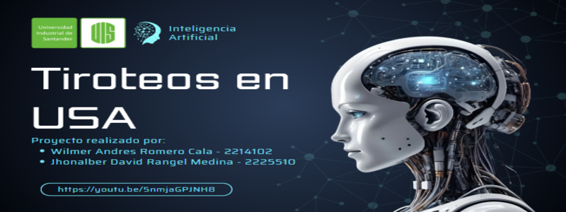

# 🔫 Tiroteos en USA - Predicción con Inteligencia Artificial

Este proyecto utiliza técnicas de inteligencia artificial para predecir el número de víctimas (heridos y fallecidos) en tiroteos simulados en Estados Unidos, aplicando modelos de redes neuronales y clustering no supervisado.

## 👥 Autores
- **Wilmer Andres Romero Cala** - 2214102  
- **Jhonalber David Rangel Medina** - 2225510  
- Universidad Industrial de Santander

## 🎯 Objetivos del Proyecto
- Predecir el número total de heridos.
- Predecir el número total de fallecidos.
- Analizar patrones mediante clustering (K-Means, DBSCAN).
- Reducir la dimensionalidad con PCA.

## 📁 Estructura del Repositorio
- `Notebook_Tiroteos_USA.ipynb`: Cuaderno principal con el desarrollo del proyecto en Python.
- `Presentación_Tiroteos_Usa.pptx`: Presentación explicativa del proyecto.
- `Banner_IA.png`: Imagen de portada.
- `README.md`: Este documento.

## 🔍 Tecnologías utilizadas
- Python 3
- Pandas, Scikit-learn, Keras, Matplotlib
- Jupyter Notebook

## 📊 Resultados destacados
- Modelos entrenados para predecir las víctimas con redes neuronales.
- Identificación de grupos de eventos mediante clustering.
- Visualización de datos normalizados y simulados.

## 🎥 Video del Proyecto

---

### 💡 Nota
Este proyecto se desarrolló con fines educativos para la materia de Inteligencia Artificial.

